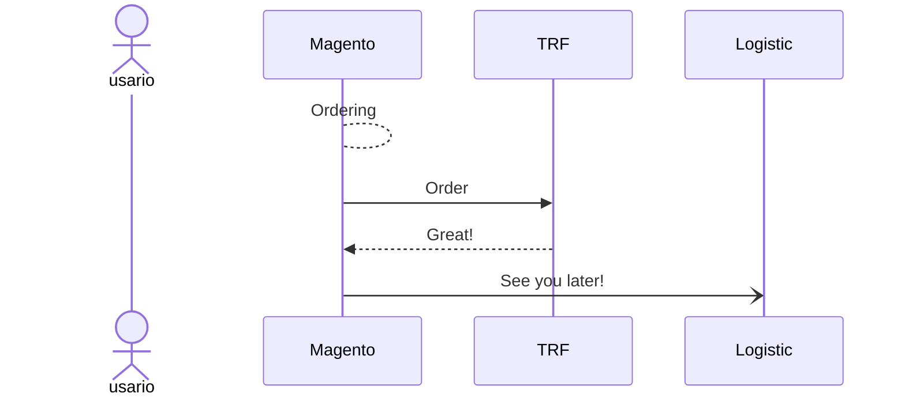

Sequence

1. Captured Payment [Processing]
2. Asignación tienda [Processing]
3. Confirmación captured importe Stripe [Processing]
4. Confirmación asignación Tienda [Asignado]
5. Envío pedido a TRF(pedido recibido x TRF) [A preparar]
6. Pedido en preparación [Pendiente preparación]
7. Pedido listo [Pendiente entrega] -Nofiticación a usuario "Su pedido ya está listo"
8. Ticket añadido. Fecha, ticket carrier, ticket order [Pendiente de entrega]
9. A la espera de ser recogido x carrier(?)[Completo Preparado Envío]
10. Transpotista recoge pedido [Transito] -Notificacion a usuario "u pedido se está enviando."
11. Transportista empieza reaparto [Enviado] FEcha + hora
12. 